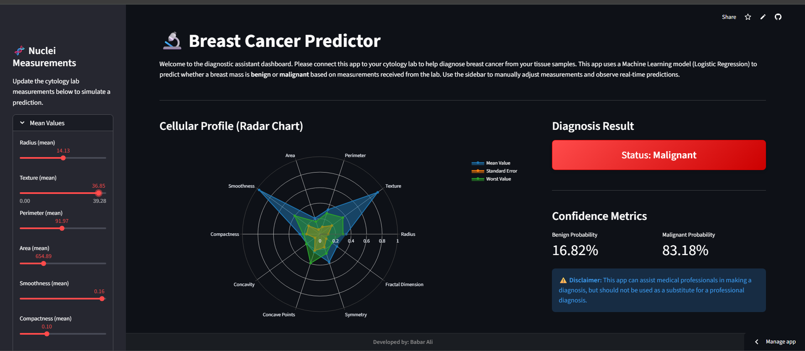

<h1 align="center">🔬 Breast Cancer Predictor App </h1>

<div align="center">
  <a href="https://ai-breast-cancer-predictor.streamlit.app/"><strong>🔗 View Live Demo</strong></a>
  <br><br>
  
  
  
  
</div>

<br>



##  Overview
The **Breast Cancer Predictor Dashboard** is a machine learning-powered web application designed to assist medical professionals and cytology labs in diagnosing breast cancer. By inputting cellular measurements obtained from fine needle aspirate (FNA) digitized images, the model predicts whether a breast mass is **Benign** or **Malignant** with high accuracy.

##  Live Application
Try out the application here: **[Breast Cancer Predictor Streamlit App](https://ai-breast-cancer-predictor.streamlit.app/)**

---

##  Key Features
* **Interactive UI:** A clean, collapsible sidebar to input 30 different cellular measurements without overwhelming the user.
* **Real-time Predictions:** Instantly calculates the probability of a tumor being benign or malignant.
* **Visual Diagnostics:** Features a dynamic **Plotly Radar Chart** that visually maps the cellular profile (Mean, Standard Error, and Worst values) for quick visual assessment.
* **Modern Styling:** Custom CSS for color-coded status badges and a professional dashboard layout.

---

##  Technology Stack
* **Frontend:** [Streamlit](https://streamlit.io/)
* **Machine Learning:** [Scikit-Learn](https://scikit-learn.org/) (Logistic Regression)
* **Data Manipulation:** Pandas, NumPy
* **Data Visualization:** Plotly

---

##  Run Locally

To run this project on your local machine, follow these steps:

**1. Clone the repository**
```bash
git clone [https://github.com/babaralimahar/Breast-Cancer-Predictor.git](https://github.com/babaralimahar/Breast-Cancer-Predictor.git)
cd Breast-Cancer-Predictor
